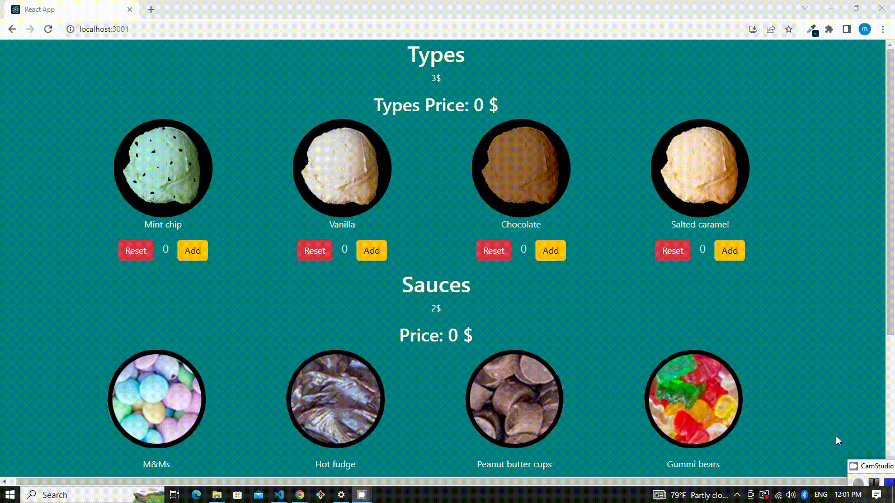

# Ice App

### I've developed an Ice App by using Unit Testing.

### You can add different types of scoops and also reset their counts. Then toopings are choosen with tick by yourself and prices are counted automatically.

In my application I've used Bootstrap for styling, Json-Server as a fake API and Axios for fetching data.

## Screen Gif

